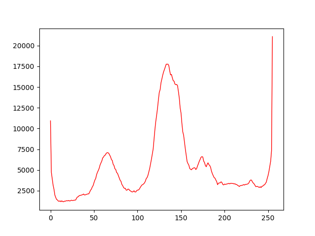

# Chapter 3

## 디지털 영상

---

- OpenCV는 기본적으로 BGR 순으로 채널이 나뉘어져 있으며, 256단계로 양자화 되어 있다.
- HSV 컬러 모델은 H(Hue):색상, S(Saturation):채도, V(Value): 명암으로 이루어 져있기에 어두운 영상에색상 검출을 해야 할 때 명확하게 쓸 수 있다.

### 이진화

- 명암 영상을 이진화하려면 임곗값 *T* 를 정하고 그것 보다 큰 화소는 1, 작은 화소는 0으로 바꾼다

### 오츄 알고리즘

- 이런 식으로 히스토그램에 계곡이 많이 보이면 이진화를 하기 굉장히 까다로운데 otsu는 이진화를 식의 최적화 문제로 바라보고 해결했다.
- 간단하게 설명하면 명암값에 대해 목적 함수를 계산하고 그 값이 최소인 명암값을 최적값으로 설정해 그 값으로 이진화 한다.
- 목적 함수 *J* 는 *t* 로 이진화했을 때 0과 1로 나눠진 각각의 분산이 작아야 균일하기 때문에 더 높은 점수를 얻도록 설계하였다.
    - J(t) = n0(t) * v0(t) + n1(t) * v1(t)  
       여기서 n은 이진화 된 화소의 개수이고 v는 분산을 뜻한다 

<a href="https://commons.wikimedia.org/wiki/File:Otsu%27s_Method_Visualization.gif#/media/File:Otsu's_Method_Visualization.gif"> <a href="https://creativecommons.org/licenses/by-sa/4.0" title="Creative Commons Attribution-Share Alike 4.0">CC BY-SA 4.0</a>, Image from <a href="https://commons.wikimedia.org/w/index.php?curid=67144384">Wikipedia</a>

- 하지만 모든 후보 해에 대해 식을 일일이 계산해야 하기 때문에 스네이크 알고리즘(그리디)이나 역전파 알고리즘(백프로퍼게이션)을 쓰는게 훨씬 좋다

### 모폴로지

- 영상을 변환하는 과정에서 하나의 물체가 여러 영역으로 분리되거나 다른 물체가 한 영역으로 붙는 경우 등이 발생하는데, 이러한 부작용들을 줄이기 위해 모폴로지 연산을 사용한다.
- 기본 연산으로 팽창(dilation), 침식(erosion)이 있다.
- 팽창은 구조 요소를 중심이 1이고 화소 양 옆을 구조 요소로 설정한 뒤 맞는 모든 픽셀에 적용한다.
- 침식은 반대로 구조 요소를 중심이 1 그리고 화소 양 옆도 1로 설정한 뒤에 모든 조건이 만족하지 않는다면 중앙 요소를 0으로 바꾼다.
- 여기서 팽창한 결과에 침식을 적용하면 닫힘(closing) 이라고 하고, 침식한 결과에 팽창을 적용하면 열림(opening) 이라고 한다.
- 